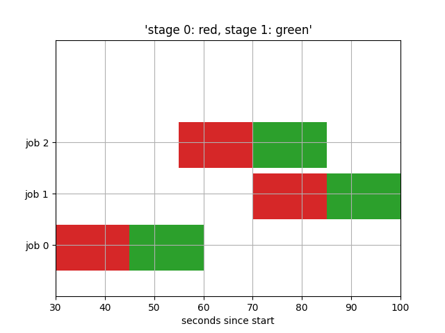

# jobshop

We extend SimPy to model a priortised job shop problem. 

In this model, user can define the operations for each job, the priority for each operations, and also each machine can choose the time to take breaks

